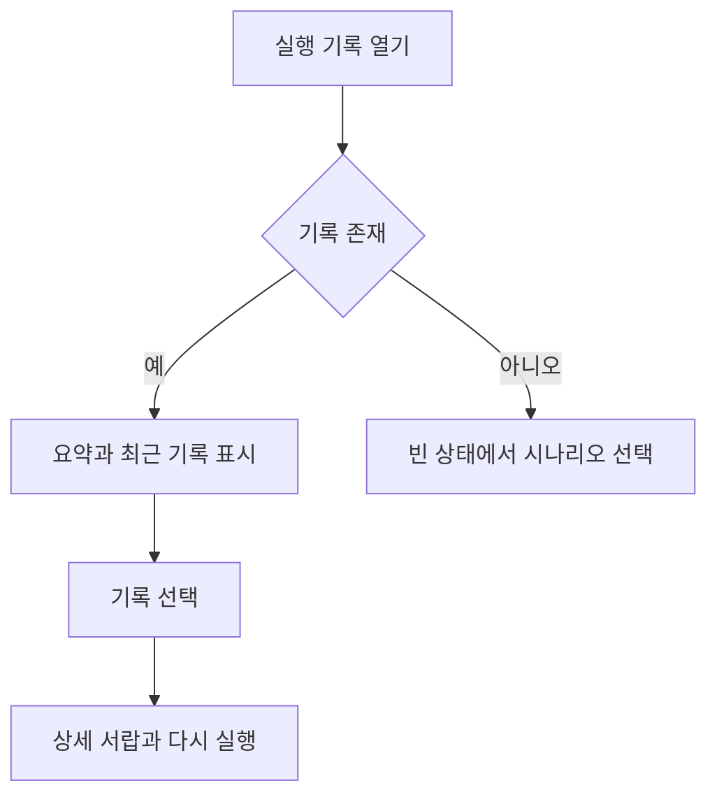

# [사용자 흐름] 대시보드

```mermaid
flowchart TD
  A[실행 기록 열기] --> B{기록 존재}
  B -->|예| C[요약과 최근 기록 표시]
  C --> D[기록 선택]
  D --> E[상세 서랍과 다시 실행]
  B -->|아니오| F[빈 상태에서 시나리오 선택]
```

| 사용자 액션 | 시스템 동작 |
| --- | --- |
| 기록 선택 | `RunReportDrawer`를 열어 단계별 결과 표시 |
| 다시 실행 | 기록의 시나리오 배열로 실행 화면 이동 |
| 빈 상태 버튼 | 선택 화면으로 이동 |

