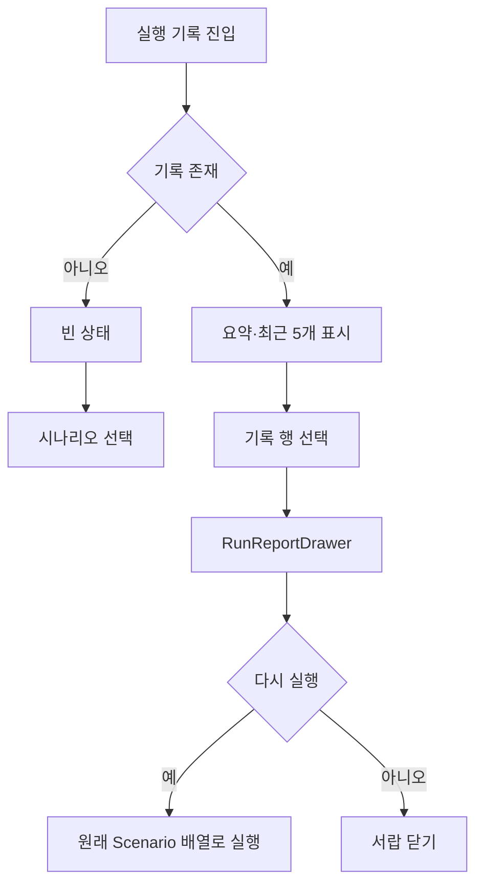

# [사용자 흐름] 대시보드

| 단계 | 사용자 액션 | 시스템 동작 | 다음 단계 |
| --- | --- | --- | --- |
| 1 | 시나리오 선택 | picker route로 전환 | 실행 대상 선택 |
| 2 | 전체 실행 | run route로 전환 | 현재 편집 원문의 모든 시나리오 실행 |
| 3 | 기록 선택 | 선택 record를 drawer state에 저장 | 상세 표시 |
| 4 | 다시 실행 | record의 Scenario 배열로 `beginRuns` | 실행 화면 |

