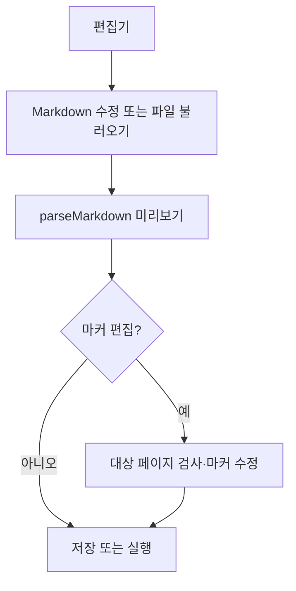

# [사용자 흐름] 시나리오 편집

| 사용자 액션 | 화면·시스템 동작 |
| --- | --- |
| 저장 | 현재 Markdown을 앱 저장소 또는 선택된 파일에 기록 |
| 파일 불러오기 | Markdown을 읽고 활성 파일 경로 설정 |
| 화면에서 추출 | Playwright 검사 후 연결 상태 표시 |
| 마커 추가/수정 | 단계와 좌표를 변경하고 위치 저장 |

