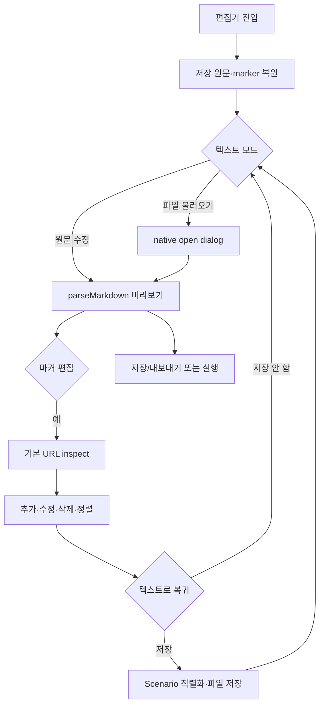

# [사용자 흐름] 시나리오 편집

| 사용자 액션 | 시스템 동작 | 결과 |
| --- | --- | --- |
| 원문 입력 | 첫 블록을 현재 Scenario로 갱신 | 미리보기 즉시 변경 |
| 불러오기 | 외부 파일 읽고 활성 경로 설정, 기본 원문에도 저장 | 이후 저장은 외부 파일 덮어쓰기 |
| 저장 | 활성 파일 있으면 덮어쓰기, 없으면 save dialog | 기본 원문도 갱신 |
| 마커 모드 | `qa:inspect`로 연결 상태 확인 | 실패 시 토스트 |
| 캔버스 클릭 추가 | 클릭 위치·추출 target으로 pending marker 생성 | dialog 완료 시 단계 추가 |
| drag | 단계 배열 이동 후 id 1부터 재부여 | 선택 id도 보정 |
| 실행 | marker 변경을 임시 직렬화한 전체 원문 파싱 | background 실행, 다른 화면 유지 가능 |

