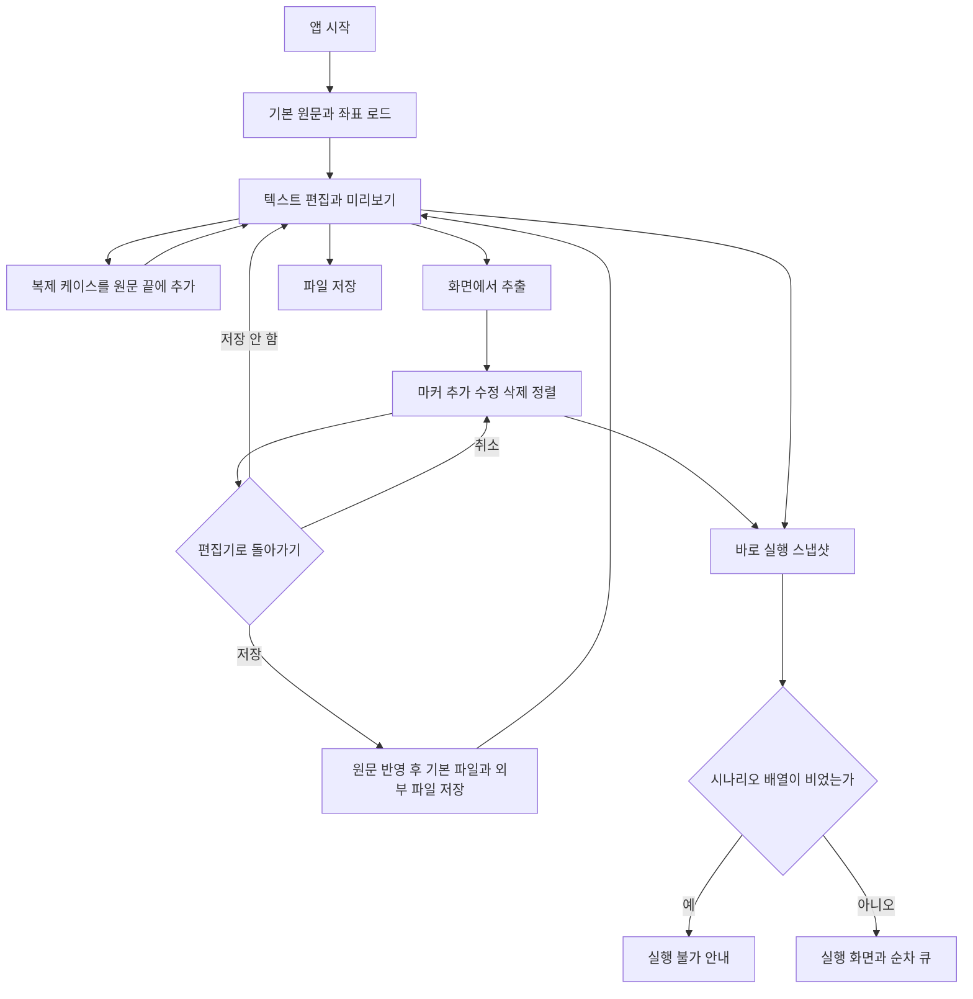

# 사용자 흐름·상태 전이

> **범위**: 편집기 입력부터 저장·실행 전달까지. 원문과 마커 좌표는 저장 시점이 다릅니다.

| 사용자 액션 | 상태 변경·효과 | 저장 여부 |
| --- | --- | --- |
| 원문 편집 | sourceMarkdown 변경, 첫 파싱 시나리오 선택 | 메모리만 |
| 파일 불러오기 | 원문 교체, 활성 외부 경로 설정, 기본 원문 저장 후 savedMarkdown 갱신 | 기본 파일 저장; 가져온 파일은 읽기만 |
| 텍스트 저장 | 활성 외부 경로 덮어쓰기 또는 save dialog, 이후 기본 원문 저장 | 두 쓰기 모두 성공하면 savedMarkdown 갱신 |
| 복제 | 원문 끝에 케이스별 새 블록 추가 | 메모리만 |
| 마커 모드 진입 | inspect 결과를 connected에 반영 | 좌표 store는 별도 자동 저장 |
| 다른 편집 시나리오 선택 | 현재 마커 블록을 sourceMarkdown에 반영 후 선택 대상 복원 | 원문 파일은 저장하지 않음 |
| 편집기로 돌아가기 → 저장 | 블록 직렬화, 원문 갱신, 기본 파일 → 활성 외부 파일 순서로 저장 | 실패해도 finally에서 텍스트 모드로 이동 |
| 편집기로 돌아가기 → 저장 안 함 | 텍스트 모드만 전환 | 현재 마커 객체를 되돌리지 않음; 이전에 반영한 원문·자동 저장 좌표도 유지 |
| 상단 텍스트 편집 탭 | setEditorMode 직접 호출 | 저장 확인·직렬화 없이 전환 |
| 편집기 바로 실행 | 마커 변경을 포함한 전체 원문 스냅샷 → beginRuns | 원문 파일 저장 없음 |
| 하단 실행 | 실행 화면에서는 runQueue, 다른 화면에서는 executableScenarios 사용 | 현재 마커를 commit하는 경로가 아님 |
| 다른 페이지로 이동 | App의 편집 훅 상태 유지, 페이지 로컬 상태는 재생성 가능 | 이탈 저장 확인 없음 |

> **현재 제한**: 복귀 확인은 `편집기로 돌아가기` 버튼에만 연결됩니다. `저장하지 않고 돌아가기`를 전체 변경 롤백으로 해석하면 안 됩니다. 마커 변경까지 실행하려면 편집기의 바로 실행 경로를 사용합니다.
