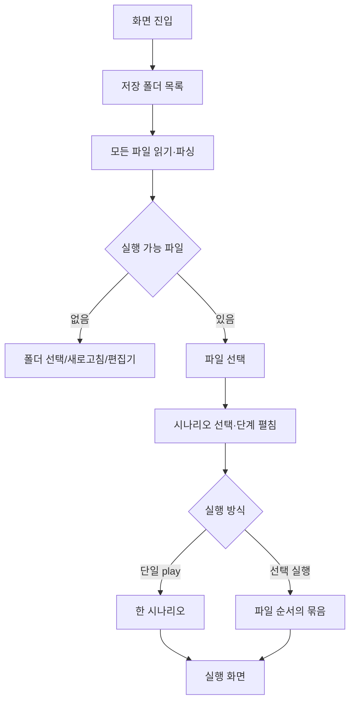

# [사용자 흐름] 시나리오 선택

| 액션 | 동작 |
| --- | --- |
| 폴더 변경 | native directory dialog 후 경로 저장·전체 재로드 |
| 파일 다시 불러오기 | 저장 폴더를 다시 읽어 cache 교체 |
| 시나리오 행 | 선택 집합 toggle |
| 단계 | 펼침 집합 toggle |
| 단일 play | 선택 여부와 무관하게 한 개 실행 |
| 카트 비우기 | 모든 선택 해제 |
| 선택 실행 | 선택된 Scenario 배열을 App에 전달 |

