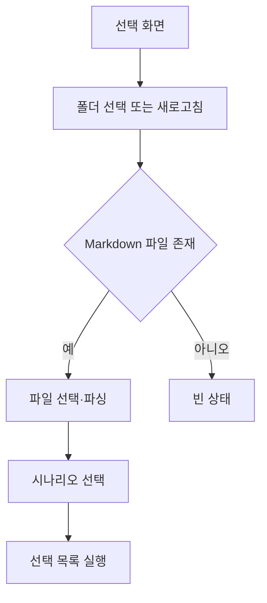

# [사용자 흐름] 시나리오 선택

| 사용자 액션 | 시스템 동작 | 다음 단계 |
| --- | --- | --- |
| 폴더 선택 | 경로 저장 후 파일 목록 조회 | 파일 선택 |
| 시나리오 토글 | 선택 집합 변경 | 실행 또는 계속 선택 |
| 단일 실행 | 한 시나리오 전달 | 실행 화면 |
| 선택 실행 | 선택 순서대로 전달 | 실행 화면 |

