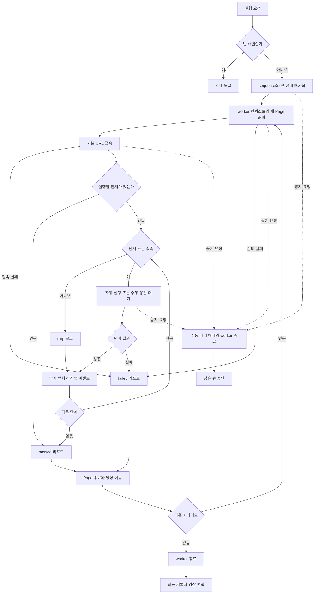

# 사용자 흐름·상태 전이

> **범위**: 요청부터 큐 종료·취소까지. `useRunOrchestration`이 UI와 main 사이를 조정합니다.

위 도표는 일반 종료 흐름입니다. 리포트 쓰기 실패는 IPC reject로 이어질 수 있으며, 자동 액션 도중 취소는 일반 예외 경로의 failed 리포트를 만들 수도 있습니다. 아래 취소 설명은 실행 중 취소를 기준으로 하며, 병합이 이미 시작된 경우는 예외 문서를 봅니다.

## 진입 경로

| 진입 | 전달되는 실행 대상 |
| --- | --- |
| 편집기의 바로 실행 | 현재 마커 변경을 반영한 전체 원문 스냅샷 |
| 선택 화면의 실행 | 파일 목록 순서(수정 시각 내림차순), 파일 내부 순서대로 선택한 Scenario 배열; 선택 클릭 순서가 아님 |
| 하단 실행 | 실행 화면이면 기존 runQueue, 그 외에는 편집 원문의 executableScenarios |
| 기록 상세의 재실행 | 선택 기록의 저장된 Scenario 배열; 최신 편집 원문을 다시 읽지 않음 |

시작 시 큐·진행·로그·단계 이미지·영상 경로·실시간 결과를 초기화합니다. 최근 기록 전체는 지우지 않습니다. 시나리오마다 `qa:start`를 await하며 결과를 모은 후 `qa:finish-worker`를 호출합니다.

## 실행 중 액션

| 사용자 액션 | 현재 처리 |
| --- | --- |
| 다른 화면으로 이동 | 실행 계속, 우측 알림에서 진행·완료와 바로가기 제공 |
| 수동 입력 제출 | qa:manual-input 전송, 입력 UI 닫기·문자열 초기화 |
| 수동 입력 취소 | qa:cancel 전송. 단계를 건너뛰는 기능이 아니라 큐 취소 경로 |
| 직접 제어 계속/실패 | qa:manual-control 응답; 실패 시 남은 현재 단계 중단 |
| 수동 판정 성공/실패 | qa:manual-result 응답; 실패 이유를 기록 |
| 실행 화면/하단 중지 | **한 번 클릭으로** cancelRuns 호출; 추가 확인 대기 없음 |
| 단일/전체 영상 다운로드 | 저장된 경로를 Downloads로 복사, 성공/실패 토스트 |
| 창 분리 | 로그·토스트만 추가. 실제 새 window는 만들지 않음 |

## 종료·취소 정책

일반 종료는 시나리오별 passed/failed를 수집하고, 취소가 없으면 묶음 기록을 먼저 만든 뒤 영상을 병합합니다. 병합 실패는 토스트만 표시하며 이미 기록한 테스트 결과를 바꾸지 않습니다. 최근 기록은 최대 5개이며 요약 수치는 묶음 실행 횟수입니다.

`cancelRuns`는 취소 ref를 설정하고 sequence를 증가시켜 이전 응답을 무효화한 뒤 qa:cancel을 비동기로 호출합니다. UI는 즉시 running=false, 알림 cancelled로 바뀝니다. main은 취소 플래그 설정, 수동 Promise 해제, worker 종료를 수행합니다. 취소가 큐 실행 중 반영되어 종료의 sequence 검사에서 걸리면 남은 큐·묶음 기록·전체 영상 병합을 진행하지 않습니다. 이미 생성된 단일 리포트·영상은 삭제하지 않습니다.

main이 cancelled를 반환하는 경로에서는 liveResults에 cancelled 항목을 넣지만, 중지 버튼이 sequence를 바꾼 경로에서는 이전 결과를 버리므로 취소 항목이 반드시 생기지는 않습니다. 이 무효화 검사는 runQa 성공 응답 뒤에 있으며 catch에는 없습니다. 늦은 reject는 실패 결과를 추가할 수 있습니다. 진행 이벤트 자체도 sequence로 필터링하지 않습니다. 자세한 race·실패 한계는 [예외 문서](04-edge-cases.md)를 봅니다.
