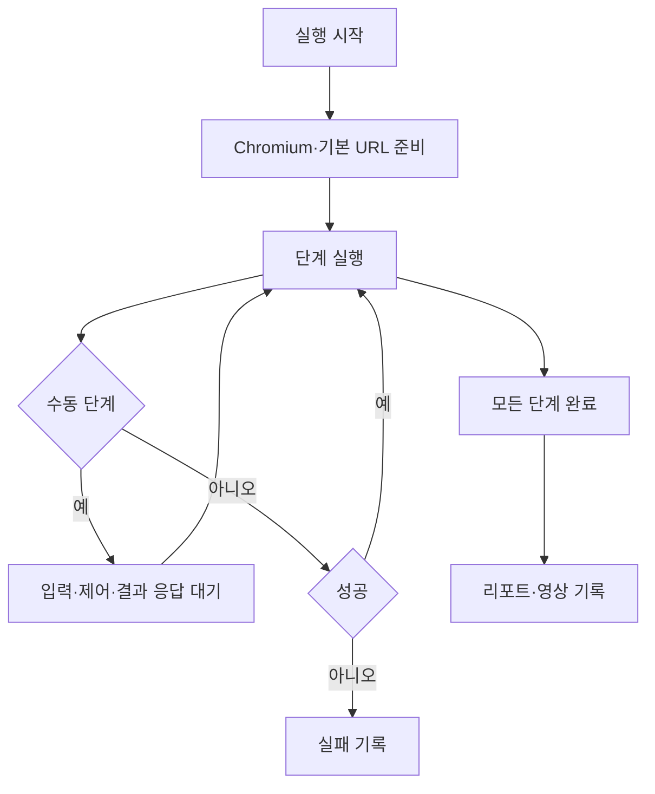

# [사용자 흐름] 시나리오 실행

| 사용자 액션 | 시스템 동작 | 결과 |
| --- | --- | --- |
| 실행 | `qa:start` 호출 | 진행 상태 표시 |
| 수동 입력 완료 | 값만 main으로 전달 | 다음 단계 계속 |
| 직접 제어 완료/실패 | 브라우저 이벤트 또는 결과 전달 | 계속 또는 실패 |
| 중단 | active run 취소·worker 종료 | 취소 결과 |
| 영상 다운로드 | 허용된 실행 영상을 Downloads로 복사 | 복사 경로 반환 |

