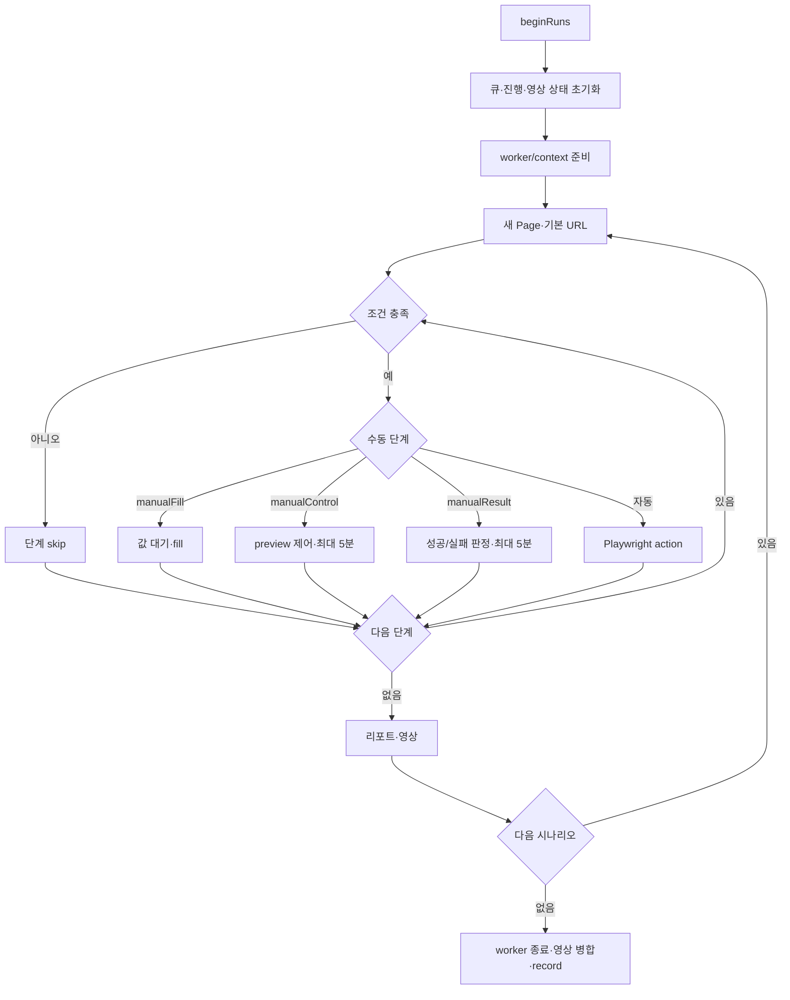

# [사용자 흐름] 시나리오 실행

| 액션 | 시스템 동작 | 결과 |
| --- | --- | --- |
| 실행 | run route 또는 background 실행 | 큐 시작·알림 |
| 실행 화면 밖 이동 | 실행 유지 | 우측 알림으로 진행 표시 |
| 수동 입력 제출 | 값만 main Promise에 전달 | target fill 후 재개 |
| 직접 제어 | click/wheel/key/text를 활성 Page에 전달 | 완료/실패 전까지 대기 |
| 수동 판정 성공/실패 | result Promise 해결 | 계속 또는 시나리오 실패 |
| 중지 첫 클릭 | confirmStop 3.5초 | 실행 유지 |
| 중지 두 번째 클릭 | sequence 무효화·`qa:cancel` | 큐 중단 |
| 단일/전체 영상 다운로드 | Downloads로 복사 | 토스트 |

