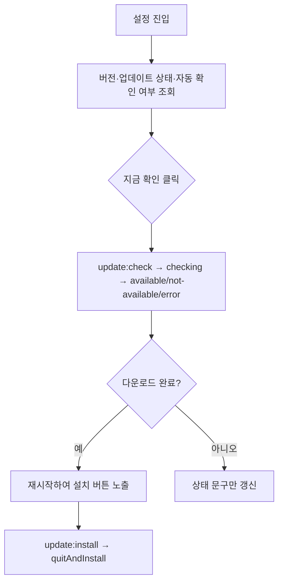

# [사용자 흐름] 설정

| 사용자 액션 | 화면 동작 | 실제 시스템 영향 |
| --- | --- | --- |
| 지금 확인 | 상태 문구가 확인 중 → 결과로 전환 | `electron-updater`가 GitHub Releases를 조회 |
| 자동 업데이트 확인 토글 | switch UI 변경 | `update-settings.json`에 저장, 다음 주기 확인부터 반영 |
| 다운로드 페이지 열기 | 새 창 요청을 가로채 외부 브라우저로 오픈 | GitHub Releases 최신 태그 페이지 |
| 재시작하여 설치 | 다운로드 완료 상태에서만 노출 | 앱 종료 후 설치 프로그램 실행 |
| 브라우저 변경 | 버튼 클릭 handler 없음 | 없음 |
| 영상 보관 토글 | switch UI 변경 | 녹화·삭제 정책 변화 없음 |
| 실패 알림 토글 | switch UI 변경 | 알림 전송 없음 |
| Slack 토글 | switch UI 변경 | OAuth·채널·메시지 없음 |

