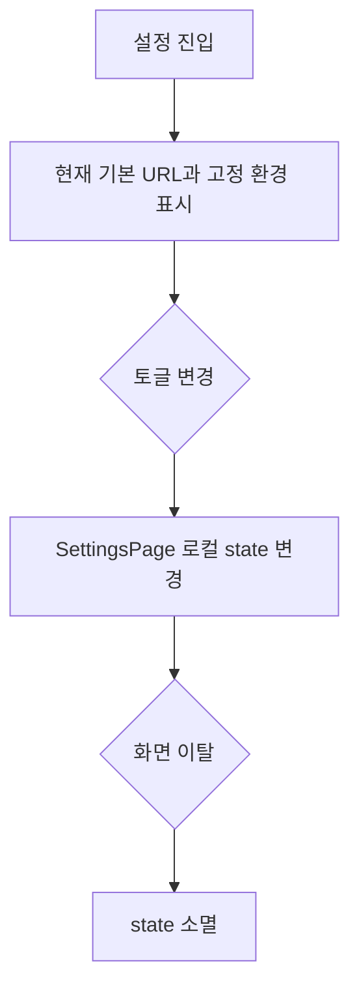

# [사용자 흐름] 설정

| 사용자 액션 | 화면 동작 | 실제 시스템 영향 |
| --- | --- | --- |
| 브라우저 변경 | 버튼 클릭 handler 없음 | 없음 |
| 영상 보관 토글 | switch UI 변경 | 녹화·삭제 정책 변화 없음 |
| 실패 알림 토글 | switch UI 변경 | 알림 전송 없음 |
| Slack 토글 | switch UI 변경 | OAuth·채널·메시지 없음 |

