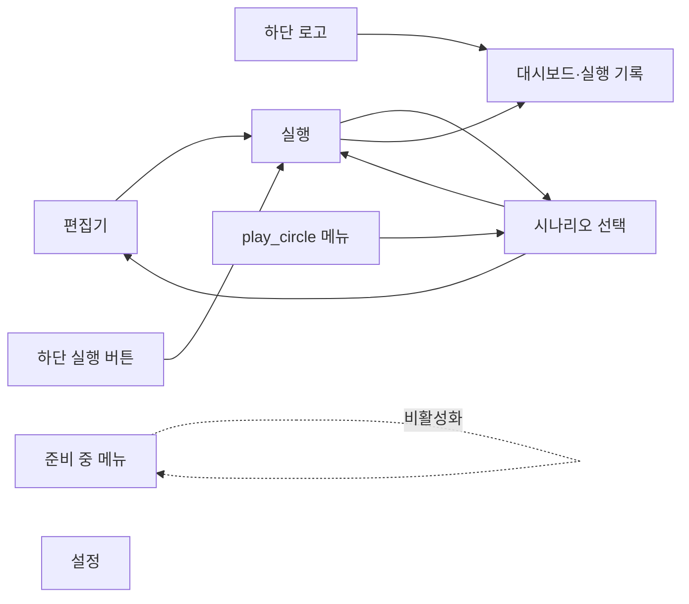

# 화면·기능별 개발 문서

> **범위**: `App.route`가 표시하는 현재 5개 화면과 화면 사이의 실행·재실행 흐름입니다.

| 번호 | 기능 | 진입점 | 핵심 책임 |
| --- | --- | --- | --- |
| 010 | [대시보드](010-dashboard/README.md) | 하단 로고 | 최근 실행 요약·상세·재실행 |
| 020 | [시나리오 편집](020-scenario-editor/README.md) | 하단 편집기 | Markdown·마커 작성과 파일 저장 |
| 030 | [시나리오 선택](030-scenario-picker/README.md) | 하단 `play_circle` 메뉴 | 폴더 파일 탐색과 다중 선택 |
| 040 | [시나리오 실행](040-scenario-run/README.md) | 선택 화면·하단 실행 버튼 | Playwright 실행·수동 단계·영상 |
| 050 | [설정](050-settings/README.md) | 하단 설정 | 현재 URL과 표시용 토글 |

## 화면 전환

URL 라우터는 없습니다. `BottomNavigation`과 각 페이지 callback이 `App.route`를 바꿉니다. 하단 로고만 대시보드·실행 기록으로 이동합니다. 편집기 다음의 `play_circle` 메뉴가 시나리오 선택 화면으로 이동하며, 하단의 큰 실행 버튼은 현재 시나리오 실행을 시작합니다.

실행은 다른 화면을 보고 있어도 계속되며 우측 알림에서 진행·완료 상태와 실행 화면 바로가기를 제공합니다.
